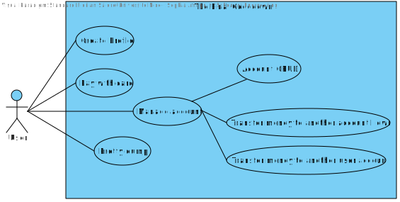
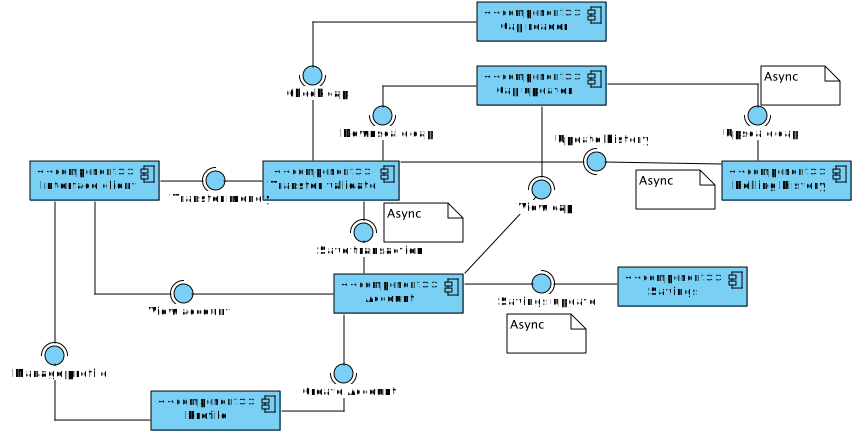
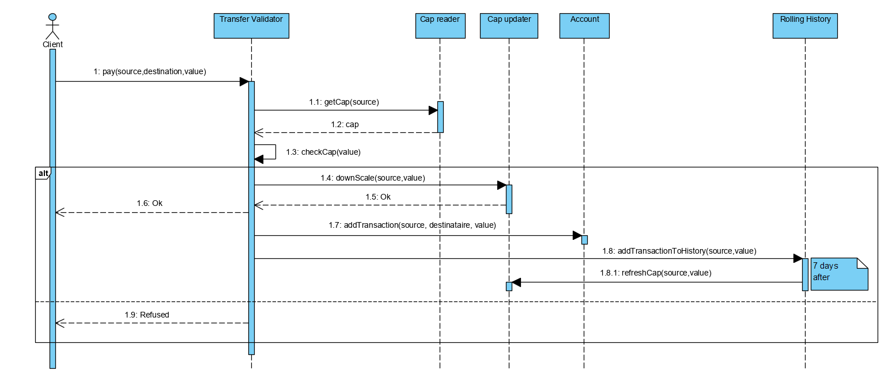
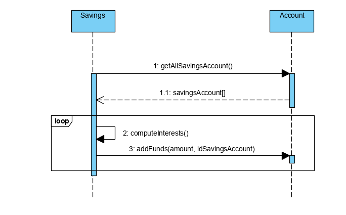

# Groupe AL-E
# V9 Scale Load generator and architecture to handle loads

## Exclusion du scope

Notre objectif est de mettre en place un service capable de passer à l’échelle face à une montée en charge. Nous n’allons pas développer d'interface graphique pour nous concentrer sur l'architecture et les capacités de montée en charge de notre back-end. C’est pour ces même raisons que nous n’allons pas mettre en place les paiements entre amis à l’aide de téléphones portables.  
L’aspect sécuritaire n’est pas notre premier objectif à l’heure actuelle non plus, malgré le fait que certaines couches de sécurité peuvent impacter les performances globales.  
Notre solution se concentrera uniquement sur la gestion de l’argent et pas sur les actions, ni sur le portfolio.

## Inclusion du scope 

- Un utilisateur possède un profil, qui est associé à un ou plusieurs comptes. Chaque compte chèque est accompagné d’une carte de débit. Il n’y a pas de carte pour un compte épargne. Les cartes de crédit ne sont pas supportées par le système.
- Gestion de plusieurs types de comptes : chèque / épargne.
- Transactions entre comptes du même profil et de profils différents autorisées.
- A la création d’un compte, l’utilisateur possédera un montant d’argent fixe.
- Les comptes épargne fonctionnent sous un régime de calculs bi-mensuels d’intérêts.
- Pretty dump afin d'agréger différentes statistiques des différents services.
- L’utilisateur peut payer avec sa carte.
- Système de plafond glissant pour les cartes.
- Pas de découvert autorisé : toute transaction passant le compte sous les 0 est refusée.

Pour notre solution nous avons prévu de développer une **CLI** minimaliste afin d'effectuer les opérations décrite ci-dessus et le Pretty Dump.  
Au niveau des calculs intéressants à surveiller nous avons le plafond glissant sur les 7 derniers jours, qui doit être vérifié à chaque transaction, ainsi que les intérêts bi-mensuels des comptes épargne. Ils permettront de prouver que notre solution est capable de tenir la montée en charge.  

Au niveau non fonctionnel, les points en gras seront ceux sur lesquels nous allons nous concentrer en premier lieu. Nous essayerons aussi de traiter les autres points en fonction de l’évolution du projet et de notre avancement.

- **Étude du système au niveau de la montée en charge, recherche de bottlenecks, de la quantité de cpu/mémoire utilisé.**
- Gestion des inconsistances des données.
- Etude du comportement si crash d’un composant.
- Comparaison de performance des différentes technologies envisagées.
- **Benchmark des différentes versions de notre solution.**
- Gestion des transactions rejetées.

## Évaluation du système

Nous avons décidé de baser notre analyse sur plusieurs points critiques marqués en gras ci-dessous : 

- **Vitesse de réponse / quantité de requêtes. (exemple : le système met deux secondes à répondre) : évaluation de la complexité empirique des opérations en fonction du nombre d’utilisateur (exemple de 100 utilisateurs à 1000 utilisateurs, temps linéaire, quadratique ou exponentiel).**
- Latence pour une opération atomique de paiement (exemple : sur les deux secondes, le système a mis 1 seconde avant de traiter la requête).
- **Vitesse de scaling horizontal (temps de démarrage d’une instance d’un service) en réponse à un pic de charge.**
- Quantité de profils supportés (temps d’accès à la base de données pour un profil par exemple).
- Gestion de la concurrence si plusieurs paiements en même temps sur le même compte avec pas assez d’argent
- **Simulation de latence réseau (localhost/ADSL/fibre/2G/3G/4G/5G)**
- Simulation de perte de paquets
- Consommation électrique : consommation des machines en fonction de la charge supportée afin d’évaluer le coût du service

## Personas

Nous avons **Roger**, qui est un utilisateur de Créditrama. Il cherche a gérer son compte sans accrocs, ou ralentissement du système qui pourrait lui faire perdre confiance en sa banque. Son objectif est de simplement pouvoir payer avec sa carte bleue 

Ensuite nous avons **Gueta**, qui profite de sa récente rentrée d’argent pour se permettre de se créer plusieurs comptes chez Créditrama. Elle a besoin de gérer plusieurs comptes, dont des comptes épargne.  

Nous avons également **Pascale**, l’administratrice du système travaillant chez Créditrama, qui a pour mission de surveiller les comptes de ses clients avec le Pretty Dump.

Enfin nous avons **Sigmund**, un des gros actionnaires de Créditrama, qui aime que le système fonctionne correctement et veut des analyses du système sous plusieurs angles afin de faire travailler les équipes de développeurs de manière efficace.

## Use case

## Diagramme de composants

## Diagrammes de séquence

### Scénario 1 : payer

### Scénario 2 : calcul des intérêts

## Diagramme d'interfaces

